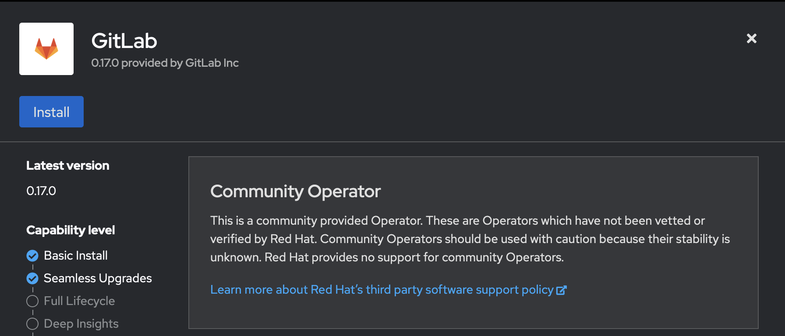
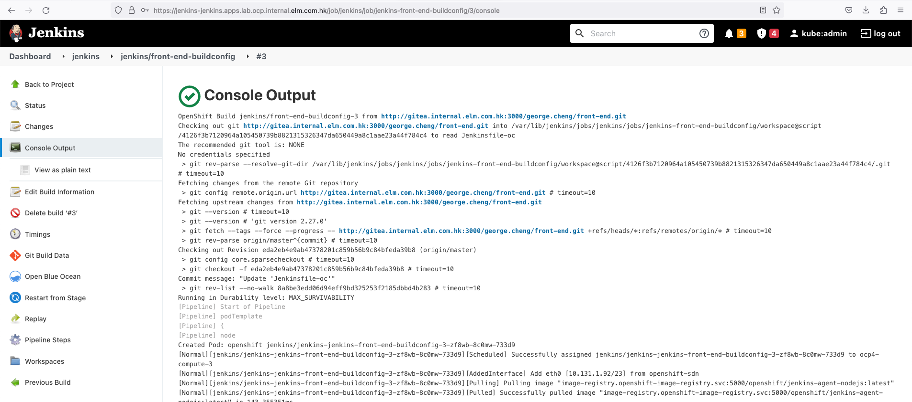

# Open Source Pipeline
## Overview
In this initiative, our goal is to establish a robust DevOps toolset and pipeline framework that will aid our insurance client in efficiently deploying their containerized software to their customers. The client has already made tool selections, and our role involves assisting them in implementing these tools within their Proof of Concept (POC) environment. To demonstrate the effectiveness of this toolchain, we'll be using a separate application for illustrative purposes.

## Deploy GitLab on OpenShift
Reference : https://docs.gitlab.com/ee/install/openshift_and_gitlab/
## Installing the GitLab Operator
1. Login to OpenShift with administrator privilege and go to OperatorHub. Search gitlab

2. Click "GitLab" community edition and click "Install" button.

3. Take default setting and click "Install' button.

4. You will find the GitLab operator will be installed under gitlab-system

5. Open an terminal and login to OpenShift. Then create ingress object for GitLab
```
cat ./ingress-nginx.yaml
apiVersion: networking.k8s.io/v1
kind: IngressClass
metadata:
  # Ensure this value matches `spec.chart.values.global.ingress.class`
  # in the GitLab CR on the next step.
  name: gitlab-nginx
spec:
  controller: k8s.io/ingress-nginx
oc create -f ./ingress-nginx.yaml
```
6. Create CA issuer. Export the OpenShiftCA secret from project openshift-cert-manager into gitlab-systems
```
oc get secret openshiftca -n openshift-cert-manager -o yaml > /tmp/tmp.yaml
change the namespace to gitlab-systems in /tmp/tmp.yaml
oc create -f /tmp/tmp.yaml
cat gitlab-issuer.yaml
apiVersion: cert-manager.io/v1
kind: Issuer
metadata:
  name: gitlab-issuer
spec:
  ca:
    secretName: openshiftca
oc create -f ./gitlab-issuer.yaml
```
7. Assign admin policy
```
oc adm policy add-scc-to-user anyuid -z gitlab-nginx-ingress -n gitlab-system
oc adm policy add-scc-to-user privileged -z gitlab-nginx-ingress -n gitlab-system
```
8. Deploy GitLab instance under gitlab-system OpenShift project
```
cat ./mygitlab.yaml
apiVersion: apps.gitlab.com/v1beta1
metadata:
  name: gitlab
  namespace: gitlab-system
spec:
  chart:
    values:
      certmanager:
        install: false
      global:
        edition: ee
        hosts:
          https: true
          domain: apps.lab.ocp.internal.elm.com.hk
          hostSuffix: null
        ingress:
          configureCertmanager: true
    version: 6.9.0
oc create -f ./mygitlab.yaml
```
9. Create OCP route
```
oc create route edge --service gitlab-webservice-default --port http-workhorse
```
10. Get the initial root password
```
oc -n gitlab-system get secret gitlab-gitlab-initial-root-password -ojsonpath='{.data.password}' | base64 --decode ; echo
```
11. Open a browser to login to the GitLab.


12. Change the root password


## Harbor deployment
Reference: 
https://www.cnblogs.com/ericnie/p/10099856.html 
https://www.digitalocean.com/community/tutorials/how-to-install-and-use-docker-compose-on-ubuntu-22-04
https://goharbor.io/docs/2.7.0/install-config/

1.Install Harbor
RHEL 7.6  Change the hostname

2. Define the hostname and IP address mapping into name server.

3. Install docker,python

4. First, confirm the latest version available in their [releases page](https://github.com/docker/compose/releases). At the time of this writing, the most current stable version is 2.16.0.

5. Use the following command to download:
```
mkdir -p ~/.docker/cli-plugins/
curl -SL https://github.com/docker/compose/releases/download/v2.16.0/docker-compose-linux-x86_64 -o ~/.docker/cli-plugins/docker-compose
```
6. Next, set the correct permissions so that the docker compose command is executable:
```
chmod +x ~/.docker/cli-plugins/docker-compose
```
7. To verify that the installation was successful, you can run:
```
docker compose version
```
8. You’ll see output similar to this:
Output
```
Docker Compose version v2.16.0
```
9. Docker Compose is now successfully installed on your system. 
 
10. Download harbor
https://github.com/goharbor./harbor/releases
```
curl -SL https://github.com/goharbor./harbor/releases/download/v2.5.6./harbor-offline-installer-v2.5.6.tgz -o harbor-offline-installer-v2.5.6.tgz
```
```
root@localhost:~# tar -xvf harbor-offline-installer-v2.5.6.tgz
harbor./harbor.v2.5.6.tar.gz
harbor/prepare
harbor/LICENSE
harbor/install.sh
harbor/common.sh
harbor./harbor.yml.tmpl
root@localhost:~# cd harbor/
root@localhost:~./harbor# ls
common.sh  harbor.v2.5.6.tar.gz  harbor.yml.tmpl  install.sh  LICENSE  prepare
```
11. Generate a Server Certificate
https://goharbor.io/docs/2.7.0/install-config/configure-https/
```
openssl req -new -newkey rsa:2048 -addext "subjectAltName = DNS: *.dockers2.org.internal.elm.com.hk" -keyout dockers2.key -out dockers2.csr
openssl rsa -in dockers2.key -out dockers2_noph.key
rm dockers2.key
mv dockers2_noph.key dockers2.key
```
12. Login to EJBCA and generate the certificate using internal org certificate authority (https://ejbca-ce-ejbca.apps.lab.ocp.internal.elm.com.hk/ejbca/ra/#loaded)


13. Download the full chain of the certificate and name it as dockers1.pem

14. Configure Internal TLS communication between Harbor Component
https://goharbor.io/docs/2.7.0/install-config/configure-internal-tls/

```
root@localhost:~./harbor# cp harbor.yml.tmpl harbor.yml
root@localhost:~./harbor# vi harbor.yml
root@localhost:~./harbor# vi harbor.yml
root@localhost:~./harbor# ./install.sh
```

15. Test the up and running of Harbor via its web interface.
https://registry.dockers2.org.internal.elm.com.hk./harbor/projects

16. Using account admin./harbor12345


17. Enable the local docker command to trust the harbor certificate chain.

```
sudo update-ca-certificates
sudo mkdir -p /etc/docker/certs.d/registry.dockers2.org.internal.elm.com.hk
sudo apt-get install -y ca-certificates
sudo cp ./harbor/certs/ca.crt /etc/docker/certs.d/registry.dockers2.org.internal.elm.com.hk
sudo cp ./harbor/certs/ca.crt /usr/local/share/ca-certificates/
sudo update-ca-certificates
sudo systemctl restart docker
cd ./harbor
sudo docker-compose up -d
docker login https://registry.dockers2.org.internal.elm.com.hk
```

ca.crt container certificates of root and internal CA only.

## Use case for Openshift using image from Harbor
1. Download an docker image and import into Harbor registry
```
docker pull httpd
docker tag b304753f3b6e registry.dockers2.org.internal.elm.com.hk/testing/httpd:latest
```
2. Create an testing project in Harbar


3. Push the image into the Harbor registry under testing project.
```
docker login https://registry.dockers2.org.internal.elm.com.hk
docker push registry.dockers2.org.internal.elm.com.hk/testing/httpd:latest
```


4. Add Harbor as the trusted registry
```
oc create configmap registry-harbor --from-file=registry.dockers2.org.internal.elm.com.hk..443=ca.crt -n openshift-config
oc patch image.config.openshift.io/cluster --patch '{"spec":{"additionalTrustedCA":{"name":"registry-harbor"}}}' --type=merge
```

5. Deploy application on OpenShift
```
oc new-project testing1
oc create secret docker-registry harbor --docker-server=registry.dockers2.org.internal.elm.com.hk:443 --docker-username=admin --docker-password=Harbor12345
oc secrets link default harbor --for=pull
oc adm policy add-scc-to-user anyuid -z default
oc create deployment httpd --image registry.dockers2.org.internal.elm.com.hk:443/testing/httpd:latest
oc expose deploy/httpd --port 80
oc expose export httpd 
```


## Deploy Sonarqube on RedHat OpenShift

Reference : https://developer.gov.bc.ca/Community-Contributed-Content./sonarqube-on-OpenShift

## Deployment of Sonarqube

1. Download Openshift template to deploy Sonarqube
```
wget https://github.com/BCDevOps./sonarqube/blob/master./sonarqube-postgresql-template.yaml
```
2. Change the setting for deployment
```
change the apiVersion to  template.openshift.io/v1
change netapp-file-standard to nfs-client
change SONARQUBE_SOURCE_IMAGE_NAME to sonarqube:latest
```
3. Login to OpenShift with administrator privilege
```
oc login -u <username> -p <password>
oc new-app -f ../sonarqube-postgresql-template.yaml --param=SONARQUBE_VERSION=8.2.2
```
4. Get the URL for the route
```
oc get route
e.g. sonarqube-sonarqube.apps.lab.ocp.internal.elm.com.hk
```
5. Open an browser and login to the Sonarqube (admin/admin) and then change the password


6. Create an project using Manual


7. Input project name, key and branch of the source code.


8. Click Other CI


9. Generate the token for one year.


10. Note the token value and it will be used in Jenkins pipeline.


11. Define the type of source code and the steps for the code scanning.


12. Ensure the route is edge SSL by OpenShift.


13. Below is the summary of project scanning


14. Below is part of the result of front-end source code scanning.


## Creation of Sonar Scanner image
1. Refer to the step 11 in above step to download the scanner code on an Linux server with docker package installed.
2. Build the image with following Dockerfile
```
FROM centos:7.9.2009
MAINTAINER George Cheng
RUN     yum install -y unzip java-1.8.0-openjdk openssl && yum clean all
ENV     SONAR_SCANNER_VERSION=4.7.0.2747
ENV     SONAR_SCANNER_HOME=/opt/sonar
ENV     PATH=/opt/sonar/bin:$PATH
ENV     SONAR_SCANNER_OPTS="-server"
ENV     SONAR_URL="https:/./sonarqube-sonarqube.apps.lab.ocp.internal.elm.com.hk"

ADD     sonar-scanner.zip prepare.sh /tmp/
RUN     unzip -o /tmp/sonar-scanner.zip -d /opt/
CMD     sleep 1800
```
3. The content of prepare.sh is as below
```
#!/bin/sh

ssl_url=`echo $SONAR_URL | sed 's/https\?:\/\///'`
echo -n | openssl s_client -connect "${ssl_url::-1}:443"  | sed -ne '/-BEGIN CERTIFICATE-/,/-END CERTIFICATE-/p' > /tmp/cert.cert
keytool -import -noprompt -trustcacerts -file /tmp/cert.cert -alias ocproute -keystore /usr/lib/jvm/jre/lib/security/cacerts -storepass changeit
```
4. Upload the image to Harbor registry for Jenkins pipeline usage
```
podman tag <image id>
registry.dockers2.org.internal.elm.com.hk/tools/sonar-scanner
podman login https://registry.dockers2.org.internal.elm.com.hk
podman push registry.dockers2.org.internal.elm.com.hk/tools/sonar-scanner
```
5. You will see the image in the Harbor registry


## Jenkins deployment on OCP

1. Login to OpenShift with administrator privilege and deploy standard Jenkins
```
oc new-project jenkins
oc new-app jenkins-persistent
oc create sa jenkins-agent 
oc adm policy add-scc-to-user privileged -z jenkins-agent
```
2. Create BuildConfig
```
cat front-end-buildconfig
apiVersion: build.openshift.io/v1
kind: BuildConfig
metadata:
  name: front-end-buildconfig
  namespace: jenkins
spec:
  failedBuildsHistoryLimit: 5
  nodeSelector: null
  output: {}
  postCommit: {}
  resources: {}
  runPolicy: Serial
  source:
    git:
      ref: master
      uri: http://gitea.internal.elm.com.hk:3000/george.cheng/front-end.git
    sourceSecret:
      name: gitea-secret
    type: Git
  strategy:
    jenkinsPipelineStrategy:
      jenkinsfilePath: Jenkinsfile-oc
    type: JenkinsPipeline
  successfulBuildsHistoryLimit: 5
oc create -f ./front-end-buildconfig.yaml
```
3. Create secret for registry access and create rolebinding
```
oc create secret generic harbor-secret --from-literal=username='admin' --from-literal=password='xxxxxxx'
oc create clusterrolebinding jenkins-agent-admin --clusterrole=admin --serviceaccount=jenkins:jenkins-agent -n sock-shop

```
4. Define the Jenkinsfile-oc and store it on the root directory of the front-end source code in Gitea.
```
     pipeline {
        agent {
            kubernetes {
                defaultContainer 'jnlp'
                yaml """
                apiVersion: v1
                kind: Pod
                metadata:
                  labels:
                    app: nodejs-app
                spec:
                  serviceAccount: jenkins-agent
                  serviceAccountName: jenkins-agent
                  containers:
                  - name: nodejs
                    image: image-registry.openshift-image-registry.svc:5000/openshift/jenkins-agent-nodejs:latest
                    command:
                    - cat
                    tty: true
                    securityContext:
                      runAsUser: 1000
                  - name: podman
                    image: registry.redhat.io/rhel8/podman:latest
                    securityContext:
                      privileged: true
                    env:
                      - 
                        name: harbor_username
                        valueFrom:
                          secretKeyRef:
                            name: harbor-secret
                            key: username
                      - 
                        name: harbor_password
                        valueFrom:
                          secretKeyRef:
                            name: harbor-secret
                            key: password                        
                    command:
                    - cat
                    tty: true
                  - name: sonar-scanner
                    image: registry.dockers2.org.internal.elm.com.hk:443/tools/sonar-scanner:v1
                    securityContext:
                      privileged: true
                    env:
                      - 
                        name: SONAR_TOKEN
                        value: sqp_cfb95ca761e9f2000d0af27506b54232f152abe9
                      - 
                        name: SONAR_URL
                        value: https:/./sonarqube-sonarqube.apps.lab.ocp.internal.elm.com.hk
                    command:
                    - cat
                    tty: true
                  - name: tools
                    image: image-registry.openshift-image-registry.svc:5000/openshift/tools:latest
                    command:
                    - cat
                    tty: true
                """
            }
        }
        stages {
            stage('Checkout') {          
              steps {
                container('jnlp') {
                  checkout scm 
                }
              }
            }
            stage('Install Dependencies') {
              steps {
                container('nodejs') {
                  sh 'export npm_config_cache=/tmp'
                  sh 'npm cache clean --force '
                  sh 'npm install'
                }
              }
            }
            stage('Unit test') {
              steps {
                container('nodejs') {
                  sh 'npm test'
                }
              }
            }
            stage('Source code scanning') {
                steps {
                    container('sonar-scanner') {
                      script {
                          sh '/tmp/prepare.sh'
                          sh '/opt/sonar-scanner-4.7.0.2747-linux/bin/sonar-scanner -Dsonar.projectKey=front-end -Dsonar.sources=. -Dsonar.host.url=$SONAR_URL'
                      }
                    }
                }
            }
            stage('Build Docker image') {
                steps {
                    container('podman') {
                      script {
                          def appname = 'front-end'
                          def imagename = "${appname}:bv${env.BUILD_NUMBER}"
                          sh "podman build -t ${imagename} ."
                          sh "podman tag ${imagename} registry.dockers2.org.internal.elm.com.hk/sock-shop/${imagename}"
                          sh 'podman login --tls-verify=false -u $harbor_username -p $harbor_password https://registry.dockers2.org.internal.elm.com.hk'
                          sh "podman push --tls-verify=false registry.dockers2.org.internal.elm.com.hk/sock-shop/${imagename}"
                      }
                    }
                }
            }
            stage('Deploy to development') {
                steps {
                    container('tools') {
                      script {
                          def appname = 'front-end'
                          def imagename = "${appname}:bv${env.BUILD_NUMBER}"
                          sh 'echo Deploy to development using OpenShift command'
                          sh "oc set image deploy/front-end-new front-end-new=registry.dockers2.org.internal.elm.com.hk:443/sock-shop/${imagename} -n sock-shop"
                      }
                    }
                }
            }
            stage('Notifiy Instana') {
                steps {
                    container('podman') {
                      script {
                          def pipeline_name = "New release for front end with build: ${env.BUILD_NUMBER}"
                          sh "chmod 755 ./instana_feedback.sh"
                          sh "./instana_feedback.sh 'Sock Shop' \"${pipeline_name}\""
                      }
                    }
                }
            }
        }
    }
```
5. Go to the BuildConfig of OCP and trigger start-build


6. It will go to the build instance panel 


7. Pipeline will be executed and result are shown on the OpenShift 


8. You may login to Jenkins to see the same result.



9. Blue Ocean GUI


10. New version of container image for front-end is stored in Harbor registry


11. Code scanning result of front-end by pipeline can be show in the Sonarqube GUI. 


12. Latest version of front-end is deployed on front-end-new deployment on OCP with same namespace.


13. An release marker is shown on Instana to indicate the new release.


14. Open a browser and input the URL https://front-end-new-sock-shop.apps.lab.ocp.internal.elm.com.hk/
